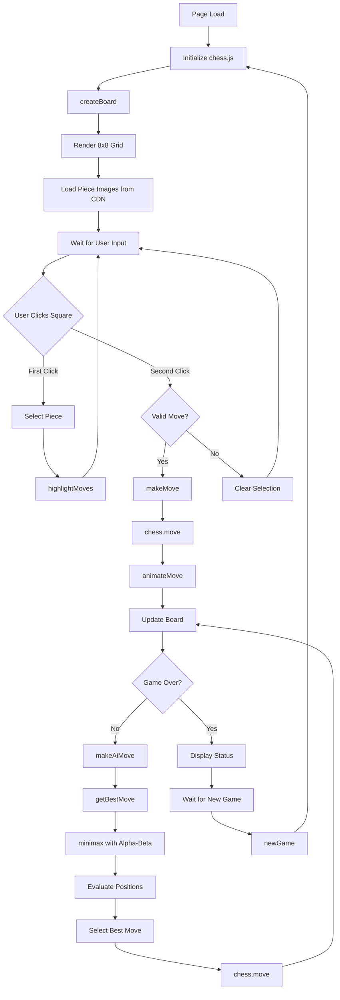

# Mouse 1 Chess - Comprehensive Project Analysis

## Table of Contents
1. [High-Level Overview](#high-level-overview)
2. [Architecture](#architecture)
3. [System Workflow](#system-workflow)
4. [Setup and Run Instructions](#setup-and-run-instructions)
5. [Domain-Specific Logic](#domain-specific-logic)
6. [File Structure](#file-structure)

---

## High-Level Overview

**Mouse 1 Chess** is a single-page web application that provides an interactive chess game with an AI opponent. The project was created as a one-minute demonstration by an AI coding autonomous agent called MOUSE-I. It's designed to be deployed as a static site, particularly on Hugging Face Spaces.

### Main Components

1. **Chess Game Engine**: Uses the `chess.js` library (v0.10.3) to handle all chess rules, move validation, and game state management
2. **AI Opponent**: Implements a minimax algorithm with alpha-beta pruning for intelligent move selection
3. **User Interface**: Modern, responsive web interface with visual feedback, animations, and difficulty controls
4. **Visual Assets**: Uses Lichess piece images loaded from CDN

### Key Features

- ✅ Full chess rule implementation (via chess.js)
- ✅ Adjustable AI difficulty (5 levels: Beginner to Master)
- ✅ Visual move highlighting and animations
- ✅ Game status tracking (check, checkmate, draw)
- ✅ Responsive design for mobile and desktop
- ✅ No backend required - fully client-side

---

## Architecture

### Technology Stack

- **Frontend**: Pure HTML5, CSS3, JavaScript (ES6+)
- **Chess Engine**: chess.js library (CDN)
- **Visual Assets**: Lichess piece SVGs (external CDN)
- **Deployment**: Static site (Hugging Face Spaces compatible)

### Component Architecture

```
┌─────────────────────────────────────────────────────────────┐
│                     index.html                               │
│  ┌──────────────────────────────────────────────────────┐   │
│  │  HTML Structure                                       │   │
│  │  - Game container                                     │   │
│  │  - Chess board (8x8 grid)                            │   │
│  │  - Difficulty slider                                 │   │
│  │  - Status display                                    │   │
│  │  - Control buttons                                   │   │
│  └──────────────────────────────────────────────────────┘   │
│                                                               │
│  ┌──────────────────────────────────────────────────────┐   │
│  │  Embedded CSS (Inline Styles)                        │   │
│  │  - Responsive layout                                 │   │
│  │  - Visual effects (gradients, animations)            │   │
│  │  - Interactive states (hover, selected)              │   │
│  └──────────────────────────────────────────────────────┘   │
│                                                               │
│  ┌──────────────────────────────────────────────────────┐   │
│  │  JavaScript Game Logic                                │   │
│  │  ┌────────────────────────────────────────────────┐  │   │
│  │  │  Game State Management                         │  │   │
│  │  │  - chess.js instance                           │  │   │
│  │  │  - selectedSquare tracking                     │  │   │
│  │  │  - userColor, aiDepth                          │  │   │
│  │  └────────────────────────────────────────────────┘  │   │
│  │  ┌────────────────────────────────────────────────┐  │   │
│  │  │  UI Rendering                                   │  │   │
│  │  │  - createBoard()                               │  │   │
│  │  │  - updateStatus()                              │  │   │
│  │  │  - highlightMoves()                            │  │   │
│  │  └────────────────────────────────────────────────┘  │   │
│  │  ┌────────────────────────────────────────────────┐  │   │
│  │  │  User Interaction                               │  │   │
│  │  │  - handleSquareClick()                         │  │   │
│  │  │  - makeMove()                                  │  │   │
│  │  │  - animateMove()                               │  │   │
│  │  └────────────────────────────────────────────────┘  │   │
│  │  ┌────────────────────────────────────────────────┐  │   │
│  │  │  AI Engine                                      │  │   │
│  │  │  - getBestMove()                               │  │   │
│  │  │  - minimax() with alpha-beta pruning           │  │   │
│  │  │  - evaluateBoard()                             │  │   │
│  │  └────────────────────────────────────────────────┘  │   │
│  └──────────────────────────────────────────────────────┘   │
└─────────────────────────────────────────────────────────────┘
                              │
                              ▼
                    ┌──────────────────┐
                    │   chess.js CDN   │
                    │  (Game Rules)    │
                    └──────────────────┘
                              │
                              ▼
                    ┌──────────────────┐
                    │  Lichess CDN     │
                    │  (Piece Images)  │
                    └──────────────────┘
```

### Module Interaction Flow



### Key Data Structures

1. **Chess Instance** (`chess`): Main game state object from chess.js
   - Handles all move validation
   - Tracks game history
   - Detects check, checkmate, draw conditions

2. **Piece Values** (`pieceValues`): Object mapping piece types to numeric values
   ```javascript
   {
     'p': 1,  // Pawn
     'n': 3,  // Knight
     'b': 3,  // Bishop
     'r': 5,  // Rook
     'q': 9,  // Queen
     'k': 0   // King (not used in evaluation)
   }
   ```

3. **Game State Variables**:
   - `selectedSquare`: Currently selected square (null or position string like "e2")
   - `userColor`: Player's color ('w' or 'b')
   - `aiDepth`: Search depth for minimax algorithm (2-6 based on difficulty)

---

## System Workflow

### Initialization Phase

1. **Page Load**:
   - HTML structure is rendered
   - External dependencies load:
     - chess.js library from CDN
     - CSS styles are applied
   - JavaScript initializes:
     - Creates new `Chess()` instance
     - Sets default values (userColor='w', aiDepth=3)
     - Calls `createBoard()` to render initial position

2. **Board Creation**:
   - Generates 8x8 grid of square divs
   - Each square gets:
     - Position identifier (e.g., "a1", "e4")
     - Color class (white/black)
     - Click event listener
   - Pieces are rendered using Lichess SVG images
   - Status bar is updated

### User Turn Workflow

1. **Square Selection**:
   - User clicks on a square
   - `handleSquareClick()` is triggered
   - If no square is selected:
     - Checks if clicked square contains user's piece
     - If valid, sets `selectedSquare` and highlights it
     - Calls `highlightMoves()` to show possible moves
   - If a square is already selected:
     - Checks if clicked square is a valid move destination
     - If valid, calls `makeMove()`
     - If invalid, clears selection

2. **Move Execution**:
   - `makeMove(from, to)` is called
   - Validates move using `chess.move()`
   - If valid:
     - Triggers `animateMove()` for visual feedback
     - After 300ms delay, calls `createBoard()` to refresh display
     - Checks if game is over
     - If not over, schedules AI move after 500ms

### AI Turn Workflow

1. **AI Move Calculation**:
   - `makeAiMove()` is called
   - Calls `getBestMove(chess, aiDepth)`
   - `getBestMove()`:
     - Generates all legal moves
     - For each move:
       - Makes the move temporarily
       - Evaluates position using minimax
       - Undoes the move
       - Tracks the best move found
     - Returns the best move

2. **Minimax Algorithm**:
   - `minimax(game, depth, alpha, beta, isMaximizing)`:
     - Base case: If depth is 0, returns board evaluation
     - Maximizing player (AI):
       - Tries all moves
       - Recursively calls minimax for opponent
       - Uses alpha-beta pruning to skip bad branches
       - Returns maximum evaluation
     - Minimizing player (User):
       - Tries all moves
       - Recursively calls minimax for AI
       - Uses alpha-beta pruning
       - Returns minimum evaluation

3. **Board Evaluation**:
   - `evaluateBoard(board)`:
     - Iterates through all 64 squares
     - Sums piece values (positive for white, negative for black)
     - Returns total evaluation score

4. **Move Execution**:
   - Best move is applied using `chess.move()`
   - Board is refreshed with `createBoard()`
   - Control returns to user

### Game State Updates

1. **Status Display**:
   - `updateStatus()` checks game conditions:
     - Checkmate: "Checkmate!"
     - Draw: "Draw!"
     - Check: Shows which player is in check
     - Normal: Shows whose turn it is

2. **Visual Feedback**:
   - Selected squares get green highlight
   - Possible moves show green dots
   - Piece moves are animated
   - Board refreshes after each move

### Game Reset

- User clicks "New Game" button
- `newGame()` is called:
  - Resets chess instance with `chess.reset()`
  - Clears selected square
  - Recreates board with starting position

---

## Setup and Run Instructions

### Prerequisites

- **Web Browser**: Modern browser with JavaScript enabled (Chrome, Firefox, Safari, Edge)
- **Internet Connection**: Required for loading external dependencies:
  - chess.js library from CDN
  - Lichess piece images from CDN
- **Web Server** (optional): For local development, any static file server works

### Dependencies

The project has **no build dependencies** or package managers. All dependencies are loaded from CDNs:

1. **chess.js v0.10.3**: 
   - Source: `https://cdnjs.cloudflare.com/ajax/libs/chess.js/0.10.3/chess.min.js`
   - Purpose: Chess game logic and rules

2. **Lichess Piece Images**:
   - Source: `https://lichess1.org/assets/piece/cburnett/{color}{type}.svg`
   - Purpose: Visual representation of chess pieces

### Installation Steps

#### Option 1: Direct File Opening (Simplest)

1. Download or clone the repository
2. Open `index.html` directly in your web browser
   - Double-click the file, or
   - Right-click → "Open with" → Select your browser
3. The game should load immediately

**Note**: Some browsers may block external resources when opening files directly. If pieces don't load, use Option 2.

#### Option 2: Local Web Server (Recommended)

**Using Python 3:**
```bash
# Navigate to project directory
cd mouse-1-chess-main

# Python 3
python -m http.server 8000

# Or Python 2
python -m SimpleHTTPServer 8000
```

**Using Node.js (http-server):**
```bash
# Install http-server globally (one-time)
npm install -g http-server

# Navigate to project directory
cd mouse-1-chess-main

# Start server
http-server -p 8000
```

**Using PHP:**
```bash
cd mouse-1-chess-main
php -S localhost:8000
```

Then open `http://localhost:8000` in your browser.

#### Option 3: Deploy to Hugging Face Spaces

1. Create a Hugging Face account
2. Create a new Space
3. Set SDK to "static"
4. Upload the project files
5. The Space will automatically serve the files

### Running the Project

1. **Start the application** (using one of the methods above)
2. **Open in browser**: Navigate to the URL (or open the HTML file)
3. **Play the game**:
   - Adjust difficulty using the slider (1-5)
   - Click on your pieces to select them
   - Click on highlighted squares to move
   - Wait for AI to respond
   - Click "New Game" to restart

### Build/Test Commands

**This project requires no build process** - it's a pure static site.

**Testing**:
- Manual testing: Play through a game and verify:
  - Pieces move correctly
  - Invalid moves are rejected
  - AI makes legal moves
  - Check/checkmate detection works
  - Difficulty slider changes AI behavior

**Browser Compatibility Testing**:
- Test in Chrome, Firefox, Safari, Edge
- Test on mobile devices (responsive design included)

### Production Deployment

1. **Static Hosting** (Recommended):
   - GitHub Pages
   - Netlify
   - Vercel
   - Hugging Face Spaces
   - Any static file hosting service

2. **Deployment Steps** (Generic):
   ```bash
   # Upload all files to hosting service
   # Ensure index.html is in root directory
   # No build step required
   ```

3. **CDN Considerations**:
   - The project relies on external CDNs
   - If CDNs are blocked, consider:
     - Downloading chess.js locally
     - Hosting piece images locally
     - Update paths in code accordingly

---

## Domain-Specific Logic

### Chess Rules Implementation

All chess rules are handled by the `chess.js` library, which implements:

- **Piece Movement Rules**:
  - Pawns: Forward movement, diagonal capture, en passant, promotion
  - Knights: L-shaped movement
  - Bishops: Diagonal movement
  - Rooks: Horizontal/vertical movement
  - Queens: Combination of rook and bishop
  - Kings: One square in any direction, castling

- **Special Rules**:
  - Castling (kingside and queenside)
  - En passant capture
  - Pawn promotion (always promotes to queen in this implementation)
  - Check detection
  - Checkmate detection
  - Draw conditions (stalemate, insufficient material, etc.)

### AI Algorithm: Minimax with Alpha-Beta Pruning

**Minimax Algorithm**:
- **Purpose**: Find the best move by exploring possible future game states
- **Depth**: Configurable (2-6 plies based on difficulty)
- **Evaluation Function**: Material-based (piece values only)

**Alpha-Beta Pruning**:
- **Purpose**: Optimize minimax by skipping branches that won't affect the final decision
- **Implementation**: Tracks `alpha` (best value for maximizing player) and `beta` (best value for minimizing player)
- **Pruning**: When `beta <= alpha`, the branch is pruned (skipped)

**Evaluation Function**:
```javascript
function evaluateBoard(board) {
    // Simple material evaluation
    // Sum of piece values (positive for white, negative for black)
    // Piece values: Pawn=1, Knight=3, Bishop=3, Rook=5, Queen=9
}
```

**Limitations**:
- No positional evaluation (piece placement, control of center, etc.)
- No endgame tablebase
- No opening book
- Fixed depth search (no time-based search)

### Difficulty Levels

The difficulty slider maps to search depth:

| Level | Slider Value | AI Depth | Description |
|-------|--------------|----------|-------------|
| Beginner | 1 | 2 plies | Very weak, makes many mistakes |
| Easy | 2 | 3 plies | Weak, can be beaten easily |
| Medium | 3 | 4 plies | Moderate strength (default) |
| Hard | 4 | 5 plies | Strong, requires good play |
| Master | 5 | 6 plies | Very strong, difficult to beat |

**Note**: Higher depth = stronger play but slower response time.

### Move Selection Logic

1. **User Moves**:
   - Must click on own piece first
   - Must click on valid destination square
   - Invalid moves are ignored
   - Promotion always to queen

2. **AI Moves**:
   - Calculates best move using minimax
   - Always makes the move with highest evaluation
   - No randomness (deterministic)

### Game State Management

- **Turn Tracking**: Managed by chess.js (`chess.turn()`)
- **Move History**: Stored in chess.js instance
- **Game Over Detection**:
  - `chess.in_checkmate()`: Checkmate detected
  - `chess.in_draw()`: Draw detected
  - `chess.in_check()`: Check detected
  - `chess.game_over()`: Any terminal condition

### UI/UX Logic

1. **Square Highlighting**:
   - Selected piece: Green box shadow
   - Possible moves: Green dots
   - Cleared on move or deselection

2. **Animations**:
   - Piece movement: Scale animation (0.3s)
   - Hover effects: Piece scale on hover
   - Smooth transitions for all state changes

3. **Responsive Design**:
   - Desktop: 560x560px board
   - Mobile (<600px): 320x320px board
   - Font sizes and spacing adjust automatically

---

## File Structure

```
mouse-1-chess-main/
│
├── index.html          # Main application file (HTML + embedded CSS + JavaScript)
├── style.css           # Additional CSS (currently unused, may be for Hugging Face Spaces)
├── README.md           # Hugging Face Spaces configuration
└── PROJECT_ANALYSIS.md # This comprehensive analysis document
```

### File Descriptions

#### `index.html`
- **Purpose**: Single-file application containing all code
- **Size**: ~450 lines
- **Contents**:
  - HTML structure (game container, board, controls)
  - Embedded CSS styles (lines 8-209)
  - JavaScript game logic (lines 231-451)
  - External script tag for chess.js

#### `style.css`
- **Purpose**: Additional styling (appears unused in current implementation)
- **Note**: All styles are embedded in `index.html`, so this file may be legacy or for future use

#### `README.md`
- **Purpose**: Hugging Face Spaces configuration
- **Contents**: YAML frontmatter for Space metadata

---

## Additional Notes

### Performance Considerations

- **AI Response Time**: 
  - Depth 2-3: Near-instant (<100ms)
  - Depth 4: Fast (<500ms)
  - Depth 5-6: May take 1-3 seconds on slower devices

- **Optimization Opportunities**:
  - Add move ordering (check captures first)
  - Implement iterative deepening
  - Add transposition table
  - Use Web Workers for AI calculation (non-blocking)

### Known Limitations

1. **AI Strength**: Material-only evaluation limits AI strength
2. **No Opening Book**: AI doesn't know common openings
3. **No Endgame Knowledge**: No tablebase for endgame positions
4. **Fixed Promotion**: Always promotes to queen (no choice)
5. **No Move History**: Can't review previous moves
6. **No Undo**: Can't undo moves
7. **No Time Control**: No chess clock or time limits

### Future Enhancement Ideas

- Add move history panel
- Implement undo/redo functionality
- Add positional evaluation to AI
- Include opening book
- Add endgame tablebase
- Allow piece promotion choice
- Add move notation display (PGN)
- Implement multiplayer mode
- Add game save/load functionality
- Include chess puzzles/training mode

---

## Quick Start for New Developers

1. **Understand the Stack**: HTML + CSS + JavaScript (no frameworks)
2. **Key Library**: Familiarize yourself with [chess.js API](https://github.com/jhlywa/chess.js)
3. **Main Entry Point**: `index.html` - everything is in one file
4. **Start Here**: 
   - Read the `createBoard()` function to understand rendering
   - Read `handleSquareClick()` to understand user interaction
   - Read `minimax()` to understand AI logic
5. **Test Changes**: Open `index.html` in browser, make changes, refresh
6. **Debug**: Use browser DevTools console for debugging

---

**Document Version**: 1.0  
**Last Updated**: 2024  
**Project Type**: Static Web Application  
**License**: Not specified

